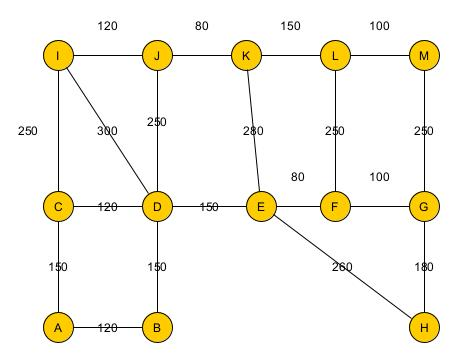
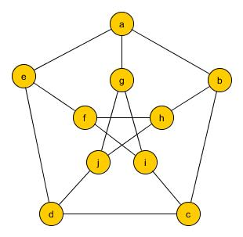
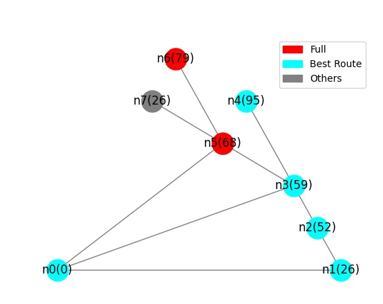

# EP01-2022.2

Este repositório apresenta um template para a execução da avaliação EP01. O objetivo desta atividade é construir funções em Python, usando o pacote o pacote [NetWorkX](https://networkx.org/) de Python que implementem as tarefas indicadas nas questões a seguir. Use a estrutura já disponível neste template. 

**Orientações Gerais**:
* Não altere a estrutura do repositório ou modifique nomes dos arquivos ou folders

* Implemente as funções ou testes solicitados sem realizar qualquer alteração em sua assinatura (nomes e parâmetros), visto que esta avaliação terá como parte de sua correção a execução de testes automáticos;

* Os grupos devem implementar as soluções exclusivamente através da representação e manipulação de grafos usando NetworkX juntamente com construções gerais de Python quando indispensável;

* Apresente documentação (comentários no código) para descrever a solução apresentada. Evite documentar em excesso, apenas o mínimo necessário para facilitar a compreensão do código;

* Organize o código de forma consistente para facilitar sua legibilidade. Por exemplo, evite espaçamentos entre linhas ou identação inconsistentes; use nomes de funções/variáveis significativos.
* Cada grupo deverá realizar este trabalho de forma individual apresentando sua própria resposta. As respostas serão inspecionadas visualmente e mecanicamente com ferramentas especializadas. Nesta inspeção, caso seja detectada cópia de resposta, o(s) grupo(s) envolvido(s) sofrerão penalidade na nota e poderão ficar com nota 0.

* É importante salientar que é de responsabilidade do grupo manter o sigilo sobre sua solução. Para tal, não deixe sua solução em locais de visibilidade pública e acesso trivial.

* O trabalho deve ser realizado estritamente em grupo. A realização e entrega individual será penalizada com diminuição de 30% do valor da nota. Casos excepcionais, tais como assistência domiciliar ou desistência/indisponibilidade de membro(s) do grupo devem ser comunicados com antecedência.

**Entrega:**

* Realizar push do repositório até o prazo definido no classroom;
* A participação de cada membro será comprovada através do histórico de edições e commits do repositório. A nota será apenas para aqueles que editarem efetivamente o repositório
* Caso o repositório seja editado após o prazo para entrega, a atividade será considerada como reposição.

## Questão 01:

A associação espacial internacional precisa enviar 2 astronautas de nacionalidades 
diferentes para uma missão a Lua.

Construa uma função, **duplas_astronauta**, que recebe como entrada uma lista de tuplas (*first_name*,*last_name*,*country*) com informações sobre astronautas e retorna um grafo onde os vértices representam  astronautas e as arestas associam todos os astronautas de nacionalidades diferentes. 
Um exemplo de uma lista que pode ser usada como entrada:

      a_list = [
            ('Kurtis', 'Shepstone', 'Italy'),
            ('Rafferty', 'Stoak', 'Canada'),
            ('Libbey', 'Anselm', 'Canada'),
            ('Odelinda', 'Thireau', 'Italy'),
            ('Rick', 'Caset', 'Canada'),
            ('Matthew', 'Fearnyough', 'Canada'),
            ('Madonna', 'Brazener', 'Canada'),
            ('Laure', 'Drohane', 'Canada'),
            ('Eleanore', 'Pollett', 'USA'),
            ('Town', 'Duddell', 'Canada')
      ]

Para esta lista, o grafo resultante terá o seguinte conjunto de vértices (G.nodes(data=True)) e arestas (G.edges):

      [(0, {'first_name': 'Kurtis', 'last_name': 'Shepstone', 'country': 'Italy'}), 
       (1, {'first_name': 'Rafferty', 'last_name': 'Stoak', 'country': 'Canada'}), 
       (2, {'first_name': 'Libbey', 'last_name': 'Anselm', 'country': 'Canada'}), 
       (3, {'first_name': 'Odelinda', 'last_name': 'Thireau', 'country': 'Italy'}), 
       (4, {'first_name': 'Eleanore', 'last_name': 'Pollett', 'country': 'USA'}), 
       (5, {'first_name': 'Town', 'last_name': 'Duddell', 'country': 'Canada'})]

      [(0, 1), (0, 2), (0, 4), (0, 5), (1, 3), (1, 4), (2, 3), (2, 4), (3, 4), (3, 5), (4, 5)]
      

**Arquivos**:
* EP01/src/Q01.py (local onde a função deve ser construída)
* EP01/test/test_Q01.py (testes automáticos)
* EP01/main_EP01_Q01.py (exemplo de uso da função)

## Questão 02:

A administração de um município necessita agrupar os quarteirões de uma cidade em distritos para facilitar sua gestão. Para tal, possui um grafo onde os vértices representam quarteirões e arestas as vizinhanças entre os quarteirões e a distância entre eles. Existem duas condições básicas a serem atendidas na divisão: 

* Existe uma lista inicial de quarteirões que já fazem parte de um distrito;
* Quarteirões de um distrito devem ser alcançáveis a partir das vizinhanças dos quateirões do distrito;
* Um quarteirão *q* pode ser incluído em um distrito quando a distância deste quateirão para os demais, através de caminhos pelos demais quateirões do distrito, é menor ou igual a um limiar de tolerância.

Construa uma função, **is_candidate**, que recebe um grafo não-direcionado ponderado *G*, representando os quarteirões da cidade, uma lista de vértices *q_list* de *G* que representam os quarteirões de um distrito, um vértice *q* de *G* representando um quarteirão, onde *q* não pertence a *q_list* e um limite para tolerância de distância *d* entre quarteirões de *q_list*. A função deve retornar *True* se *q* pode ser incorporado no distrito *q_list* e *False* caso contrário. 

Para o grafo abaixo, considerando que *q_list* = [E,F,G,H] e *t* = 500, o quarteirão D pode fazer parte do distrito, mas o quarteirão K não pode porque a distância dele para H é maior que 500. O quarteirão I não pode fazer parte de Q porque além de estrapolar a distância, não existe um caminho de H para I passando unicamente por quarteirões de Q.

**Arquivos**:
* EP01/src/Q02.py (local onde a função deve ser construída)
* EP01/test/test_Q02.py (testes automáticos)
* EP01/main_EP01_Q02.py (exemplo de uso da função)

## Questão 03

Escreva a função **graph_density** que recebe um grafo qualquer como entrada (direcionado estrito ou não-direcionado simples) e retorna a densidade do grafo de acordo com o seu tipo. O resultado deve ser um float arrendondado para 2 casas decimais.

Com exemplo, considere o grafo de Petersen (Gerador petersen_graph). A densidade deste grafo é 0.33333333... A função deve retornar 0.33.

**Arquivos**:
* EP01/src/Q03.py (local onde a função deve ser construída)
* EP01/test/test_Q03.py (testes automáticos)
* EP01/main_EP01_Q03.py (exemplo de uso da função)

## Questão 04

Um formigueiro é formado por diversos compartimentos e túneis entre os mesmos. As formigas trabalham arduamente durante todo o verão para coletar alimentos e armazenar neste compartimentos. Como os compartimentos estão a profundidades diferentes, os alimentos coletados pelas formigas podem rolar de um compartimento de maior altitude para um de menor altitude através dos túneis, facilitando assim o seu transporte e armazenamento. Considere um grafo que modela um formigueiro onde os vértices representam os compartimentos, tendo um compartimento especial, o de entrada com profundidade 0. As arestas representam
os túneis existentes entre os compartimentos. Cada vértice possui dois atributos especiais, a profundidade do compartimento, *depth*, e a indicação de que o compartimento está ou não cheio, *full*.

Construa uma função, **best_route**, que dado um grafo que modela um formigueiro *F* e a indicação do compartimento de entrada *i*, escolhe uma rota para um compartimento onde o alimento deve ser armazenado. A rota deve ser representada como uma lista de compartimentos. Para escolher cada destino na rota, a função deve considerar o seguinte:
  * o próximo compartimento a ser escolhido na rota deve ser o de menor profundidade que tem uma profundidade maior do que o atual e não deve estar cheio;
  * O compartimento a ser escolhido não deve ter sido incluído anteriormente na rota;
  * quando não existir uma opção de compartimento destino, o compartimento atual deve ser o escolhido para armazenar o alimento, sendo o ponto final da rota.

O grafo abaixo apresenta um exemplo de um formigueiro, onde a profundidade de cada compartimento está representada no label do vértice (entre parentesis). Os compartimentos cheios estão indicados em vermelho e o compartimento inicial é o 'n0'. Neste caso,
a rota será (n0, n1, n2, n3, n4).

**Arquivos**:
* EP01/src/Q04.py (local onde a função deve ser construída)
* EP01/test/test_Q04.py (testes automáticos)
* EP01/main_EP01_Q04.py (exemplo de uso da função)

## Questão 05

Um grafo de palavras é um pseudografo direcionado que pode ser utilizado para reconhecer ou gerar palavras de uma certa linguagem. Neste grafo, vértices representam posições a partir das quais certos caracteres são válidos. Existem dois vértices especiais: inicial, onde a operação inicia, e final, onde é concluída com sucesso. Cada arco possui um caracter associado, representando um próximo caracter válido. Uma palavra é reconhecida pelo grafo se for possível encontrar um passeio, do vértice inicial ao vértice final, onde o próximo arco a ser seguido deve conter o caracter da palavra que está sendo analisado. Caso o passeio não termine no vértice final, então a palavra não é reconhecida. O passeio termina ou quando a palavra já foi completamente analisada ou quando não há um arco que possa ser seguido considerando o caracter que está sendo analisado.

Implemente a função **valid_word** que recebe como entrada:
  - um multigrafo direcionado *g*, onde os arcos possuem um caracter como label;
  - a indicação de um vértice *s* (vértice inicial) e *t* (vértice final) do grafo;
  - um string *w* com uma palavra a ser analisada

A função retorna *True* se a palavra é reconhecida e *False*, caso contrário.

Para o grafo de palavras apresentado abaixo, observe que o grafo reconhece a palavra 'aabbc'. Partindo do vértice 0, considerando o primeiro caracter, 'a', o passeio segue pelo arco de label 'a', chegando no vértice 1. Como o próximo caracter é 'a', o passeio agora seguirá pelo arco correspondente, tendo como destino o vértice 1. O próximo caracter é o 'b'. Neste caso, o passeio segue pelo arco correspondente, tendo como destino o vértice 2. Em seguida, com o caracter 'b', vai para o vértice 2 pelo arco correspondente. Por fim, devido ao caracter 'c' chega no vértice 3. Neste ponto, a palavra já foi toda processada e o vértice atingido é o final. Assim, a palavra é reconhecida como válida e a função deve retornar *True*.

**Arquivos**:
* EP01/src/Q05.py (local onde a função deve ser construída)
* EP01/test/test_Q05.py (testes automáticos)
* EP01/main_EP01_Q05.py (exemplo de uso da função)

